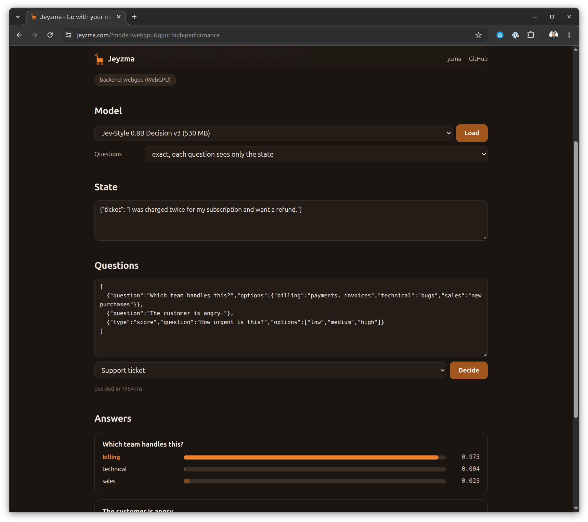

# Jeyzma

Typed decisions with a System One model, 100% local in your browser using WebAssembly written in Go.

[](https://jeyzma.com)

**<https://jeyzma.com>**

Jeyzma asks a model typed questions about a state and shows a probability for each option. The answer comes from one forward pass over the logits, with no generated text. There is no server, no API key, and no data leaves your machine. It uses the GPU through WebGPU when available, otherwise the CPU. Written in Go using [yzma](https://github.com/hybridgroup/yzma) on [TinyGo](https://tinygo.org).

## How it works

[](https://github.com/hybridgroup/yzma)

The code is written in Go and compiled with TinyGo. It uses the
[yzma](https://github.com/hybridgroup/yzma) `exp/decide` package to run
[llama.cpp](https://github.com/ggml-org/llama.cpp), compiled to a WebAssembly
module. Everything runs in a Web Worker so the page stays responsive.

```
   index.html
       |  postMessage
   worker.js
     |            \
   yzma.wasm       yzma_wasm*.js
   (Go, TinyGo) -> (llama.cpp, Emscripten)
```

`exp/decide` renders the state and each question in the format the model was
trained on, then reads the probabilities of the option tokens. `DecideMany`
decodes the state once and shares it across all the questions.

## Build and run

You need [TinyGo](https://tinygo.org/getting-started/install/) 0.41 or later, Go
1.26, and `node` for the test.

```
make build
make serve
```

Open <http://localhost:8080>, click **Load**, and wait for the model to
download. The browser caches it. Then click **Decide**.

The list has two models.

| Model | Size | Readout |
| --- | --- | --- |
| [Jev-Style 0.8B Decision v3](https://huggingface.co/chaoliangUNSW/Jev-Style-0.8B-Decision-v3-GGUF) | approximately 530 MB | `jev` |
| [JevK5 2B v0.2](https://huggingface.co/alibiserikbay/JevK5-GGUF) | approximately 2.0 GB | `jevk5` |

Neither GGUF holds the readout values, so each model needs its config file too.
Choose **Another model** to enter your own model URL, config URL, and readout.
Any URL works if the host sends CORS headers. Hugging Face does.

`make build` downloads about 13 MB of llama.cpp into `build/`, compiles the Go
program, and copies the page. The only binary files in the repository are the
social card and the screenshot.

The download comes from
[llama-cpp-builder](https://github.com/hybridgroup/llama-cpp-builder). It uses
the nightly build b11208, because `DecideMany` needs shim ABI 10 to share one
state across questions. The v0.5.0 release has ABI 9, which still works but
decodes each question separately. To use another build, pass its tag, or
`latest` for the newest nightly build.

```
make build LLAMA_VERSION=latest
```

## Questions

The questions box holds a JSON list. Each question has a `question` and
optional `type` and `options`.

| Type | Options | Answer |
| --- | --- | --- |
| `choice` | a list of names, or an object of name to description | one of the names |
| `noul` | none, or `{"false": "...", "true": "..."}` | `true` or `false` |
| `score` | a list of levels in order | the index of a level |

Without a type, a question with options is a choice and one without is noul.

```json
[
  {"question": "Which team handles this?", "options": {"billing": "payments, invoices", "technical": "bugs"}},
  {"question": "The customer is angry."},
  {"type": "score", "question": "How urgent is this?", "options": ["low", "medium", "high"]}
]
```

The state is any text. A JSON object or list keeps its key order.

**Exact** mode gives each question the same result it gets alone. **Batched**
mode is faster but can differ slightly, and on a near tie it can change a JevK5
answer. A change of mode loads the model again.

## The test

The test asks three questions in Node, without a browser. It fails when
`DecideMany` and `Decide` differ in exact mode.

```
make test MODEL=~/models/Jev-Style-0.8B-Decision-v3-Q4_K_M.gguf \
  CONFIG=~/models/readout_config.json TEST_FLAGS="--expect billing,true"
make test READOUT=jevk5 MODEL=~/models/jevk5-2b-v0.2-Q8_0.gguf \
  CONFIG=~/models/jevk5_config.json
```

## WebGPU, threads, and the service worker

llama.cpp has three WebAssembly builds. `yzma-loader.js` picks the best one the
browser can run.

| Build | What it needs |
| --- | --- |
| `yzma_wasm_webgpu` | WebGPU with f16 shaders, and JSPI. Chrome and Edge 137 or later. |
| `yzma_wasm_mt` | `SharedArrayBuffer`, so a page with the COOP and COEP headers. |
| `yzma_wasm` | Nothing. It runs everywhere. |

The loader tests the GPU against the CPU before it uses it, and falls back to
the CPU if the GPU is missing or computes wrong values. WebGPU in Firefox is
much slower than the CPU, so the loader picks the CPU there.

GitHub Pages cannot send the COOP and COEP headers, so the page loads
[`coi-serviceworker.js`](https://github.com/gzuidhof/coi-serviceworker) first.
It adds the two headers and reloads the page once, so the loader can pick the
multithreaded build. `make serve` sets the headers too.

The top right of the page shows the selected build. Add `?mode=cpu` or
`?mode=webgpu` to the URL to force a build, and `?gpu=high-performance` or
`?gpu=low-power` to pick the GPU on a machine with two. `?embed` hides the
paragraph at the top of the page.

The [yzma WebAssembly guide](https://github.com/hybridgroup/yzma/blob/main/wasm/README.md)
has more on the backends, the browsers, and how fast each one is.

## Notes

- The model must be smaller than 2 GB, the limit of one JavaScript
  ArrayBuffer.
- The CPU build is slow for the 2B model. Three questions take about 17
  seconds on 16 threads in Node.
- Discrete NVIDIA cards do not expose f16 shaders in Chrome. Start Chrome with
  `--enable-dawn-features=vulkan_enable_f16_on_nvidia` to use one.

## Deploying

`.github/workflows/pages.yml` builds and deploys on each push to `main`. Set
**Settings → Pages → Source** to **GitHub Actions** once.

The page is served at jeyzma.com. Enter `jeyzma.com` under **Settings → Pages →
Custom domain**, and point the DNS at GitHub Pages with `A` records for
185.199.108.153, 185.199.109.153, 185.199.110.153, and 185.199.111.153, and a
`CNAME` record for `www` to `hybridgroup.github.io`. A deploy from Actions does
not read a `CNAME` file, so the setting is the only place the domain lives.

## Social card

`web/social-card.png` is the preview image that social sites show for a link
to jeyzma.com. Its source is `images/social-card.svg`. Render it again after a
change.

```
inkscape images/social-card.svg --export-type=png --export-filename=web/social-card.png -w 1200 -h 630
```

## License

Apache 2.0, the same as yzma. `web/coi-serviceworker.js` is MIT and keeps its
own notice.
